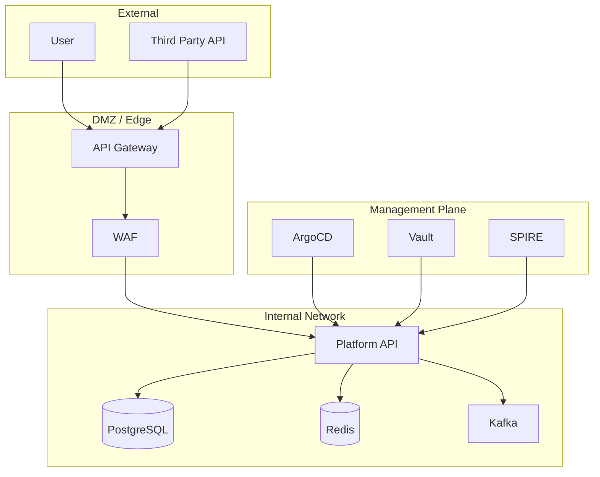

# Threat Modeling Standard

Mandatory threat modeling process for all VSR service architectures. Every architecture must include a threat model reviewed by Security Platform.

---

## 1. Process Overview

### When to Threat Model
- **New Service Architecture** — Before ARB review
- **Major Architecture Change** — New trust boundaries, data flows, external integrations
- **Quarterly Review** — For Tier 0/1 services
- **Post-Incident** — Root cause analysis feeds model updates

### Methodology: STRIDE + ATT&CK
| STRIDE | MITRE ATT&CK Mapping | Example Mitigations |
|--------|----------------------|---------------------|
| **Spoofing** | T1078 (Valid Accounts), T1556 (Password Policy) | mTLS, SPIFFE, Short-lived certs, MFA |
| **Tampering** | T1565 (Data Manipulation), T1552 (Unsecured Credentials) | Signed artifacts, Immutable logs, Encryption |
| **Repudiation** | T1562 (Impair Defenses), T1070 (Indicator Removal) | Immutable audit logs, WORM storage, Non-repudiation |
| **Information Disclosure** | T1005 (Data from Local), T1020 (Automated Exfiltration) | Encryption at rest/transit, PII masking, DLP |
| **Denial of Service** | T1498 (Network DoS), T1499 (Endpoint DoS) | Rate limiting, Circuit breakers, Auto-scaling |
| **Elevation of Privilege** | T1068 (Exploitation), T1078 (Valid Accounts) | Least privilege, RBAC/ABAC, Zero Trust |

---

## 2. Threat Model Template

Every threat model must include:

```markdown
# Threat Model: <Service Name>

**Version**: 1.0
**Date**: YYYY-MM-DD
**Author**: @github-handle
**Reviewers**: @security-team, @arch-review
**Status**: Draft | Approved | Superseded

## 1. System Overview
- **Service**: <Name>
- **Criticality**: Tier 0 | 1 | 2 | 3
- **Data Classification**: Public | Internal | Confidential | Regulated
- **Compliance Scope**: SOC2 | ISO27001 | GDPR | HIPAA | PCI | FedRAMP

## 2. Trust Boundaries (Diagram)


## 3. Data Flow Table
| Flow | Source | Destination | Protocol | Data Classification | Encryption | Auth |
|------|--------|-------------|----------|---------------------|------------|------|
| 1 | User | API Gateway | HTTPS/TLS 1.3 | Confidential | TLS 1.3 | JWT/SVID |
| 2 | API Gateway | Platform API | gRPC/mTLS | Internal | mTLS | SPIFFE |
| 3 | Platform API | PostgreSQL | SQL/TLS | Confidential | TLS 1.2+ | Cert + Password |
| 4 | Platform API | Redis | Redis/TLS | Internal | TLS 1.2+ | ACL |
| 5 | Platform API | Kafka | SASL_SSL | Internal | TLS 1.2+ | SASL/SCRAM |
| 6 | Platform API | Vault | HTTPS | Secrets | TLS 1.3 | K8s Auth |
| 7 | Platform API | SPIRE | gRPC/mTLS | Identity | mTLS | SPIFFE |

## 4. Threat Enumeration (STRIDE per Boundary)

### Boundary: External → API Gateway
| Threat | STRIDE | Likelihood | Impact | Risk | Mitigation | Residual |
|--------|--------|------------|--------|------|------------|----------|
| Credential stuffing | Spoofing | High | High | Critical | Rate limit, WAF, MFA, Account lockout | Medium |
| API key leakage | Spoofing | Medium | High | High | Short-lived JWT, Rotation, Scopes | Low |
| DDoS | DoS | Medium | High | High | Rate limit, CDN, Auto-scale, WAF | Medium |
| Injection (SQL/NoSQL) | Tampering | Low | Critical | High | Parameterized queries, ORM, Input validation | Low |

### Boundary: API Gateway → Internal Services
| Threat | STRIDE | Likelihood | Impact | Risk | Mitigation | Residual |
|--------|--------|------------|--------|------|------------|----------|
| Service impersonation | Spoofing | Low | Critical | High | mTLS, SPIFFE, Short-lived SVID | Low |
| Request tampering | Tampering | Low | High | Medium | mTLS integrity, Request signing | Low |
| Replay attack | Repudiation | Low | High | Medium | Nonce/Timestamp, Idempotency keys | Low |
| Info disclosure (logs) | Info Disclosure | Medium | High | High | Structured logging, PII scrubbing, No secrets in logs | Low |

### Boundary: Service → Data Stores
| Threat | STRIDE | Likelihood | Impact | Risk | Mitigation | Residual |
|--------|--------|------------|--------|------|------------|----------|
| SQL Injection | Tampering | Low | Critical | High | ORM, Parameterized queries, Least privilege DB user | Low |
| Data exfiltration | Info Disclosure | Low | Critical | High | Encryption at rest, Column masking, RLS, Audit | Low |
| Privilege escalation | Elevation | Low | Critical | High | Least privilege, Row-level security, Audit | Low |
| Ransomware | DoS + Tampering | Low | Critical | High | Immutable backups, WORM, Point-in-time recovery | Low |

## 5. Attack Surface Analysis
| Component | Exposure | Hardening |
|-----------|----------|-----------|
| API Gateway | Public Internet | WAF, Rate Limit, mTLS termination, Cert pinning |
| Platform API | Internal (Mesh) | mTLS, OPA AuthZ, Input validation, Circuit breaker |
| PostgreSQL | Private Subnet | TLS, RLS, Least privilege, Audit logging, Backup encryption |
| Redis | Private Subnet | TLS, ACL, No persistence for sensitive data |
| Kafka | Private Subnet | SASL_SSL, ACL, Encryption at rest |
| Vault | Private Subnet | mTLS, K8s Auth, Dynamic secrets, Lease rotation |
| SPIRE | Private Subnet | Node/Workload attestation, Short-lived SVIDs |

## 6. MITRE ATT&CK Coverage
| Tactic | Techniques Covered | Detection | Mitigation |
|--------|-------------------|-----------|------------|
| Initial Access | T1190 (Exploit Public-Facing), T1078 (Valid Accounts) | WAF, Auth logs, Failed login alerts | WAF, MFA, Rate limit, Account lockout |
| Execution | T1059 (Command/Script), T1059.004 (Unix Shell) | Falco/Tetragon eBPF, Auditd | Immutable containers, No shell, Read-only FS |
| Persistence | T1505 (Server Software), T1556 (Password Policy) | GitOps drift detection, Config audit | GitOps, Immutable infra, Short-lived creds |
| Privilege Escalation | T1068 (Exploitation), T1078 (Valid Accounts) | Falco, K8s Audit, OPA deny | Least privilege, OPA, mTLS, Short-lived SVID |
| Defense Evasion | T1070 (Indicator Removal), T1562 (Impair Defenses) | Immutable logs (Loki+S3 WORM), Falco | WORM logs, Falco, Read-only root FS |
| Credential Access | T1552 (Unsecured Credentials), T1003 (OS Credential Dumping) | Vault dynamic secrets, No secrets in code | Vault, CSI driver, No env vars, Rotation |
| Discovery | T1083 (File/Directory), T1018 (Remote System Discovery) | Falco, NetworkPolicy, Egress control | Default deny, NetworkPolicy, EgressGateway |
| Lateral Movement | T1021 (Remote Services), T1550 (Pass the Hash) | mTLS, SPIFFE, Zero Trust, NetworkPolicy | mTLS everywhere, SPIFFE, Default deny |
| Collection | T1005 (Data from Local), T1020 (Automated Exfil) | DLP, Egress control, Encryption | EgressGateway, Encryption, DLP |
| Exfiltration | T1041 (C2), T1048 (Exfil Over Alternative Protocol) | EgressGateway, DNS filtering, TLS inspection | Egress allowlist, TLS inspection, DNS sinkhole |
| Impact | T1485 (Data Destruction), T1486 (Ransomware) | Immutable backups, WORM, Versioning | Velero, PITR, WORM, Immutable infra |

## 7. Risk Register
| Risk ID | Threat | Likelihood | Impact | Risk Score | Owner | Mitigation Status | Review Date |
|---------|--------|------------|--------|------------|-------|-------------------|-------------|
| RISK-001 | Credential stuffing on API Gateway | High | High | 9 | Security | WAF + Rate limit + MFA implemented | 2026-11-16 |
| RISK-002 | SQL Injection via Platform API | Low | Critical | 6 | Platform | ORM + Param queries + WAF | 2026-11-16 |
| RISK-003 | Data exfiltration via compromised Pod | Low | Critical | 6 | Security | EgressGateway + NetworkPolicy + Encryption | 2026-11-16 |
| RISK-004 | Supply chain compromise (Base Image) | Medium | High | 8 | Security | SLSA L3 + Cosign + Trivy + Policy | 2026-11-16 |
| RISK-005 | Vault unseal key compromise | Low | Critical | 6 | Security | Shamir shares + HSM + DR procedure | 2026-11-16 |

## 8. Security Requirements (Derived)
| Req ID | Requirement | Source Threat | Verification |
|--------|-------------|---------------|--------------|
| SEC-001 | All external traffic via API Gateway with WAF | RISK-001 | Terraform test, WAF log audit |
| SEC-002 | All service-to-service mTLS with SPIFFE | RISK-003 | Mesh MTLS check, Cert expiry monitor |
| SEC-004 | All secrets via Vault, Zero static secrets | RISK-005 | Vault audit, TruffleHog scan |
| SEC-005 | All deployments signed, SLSA L3 provenance | RISK-004 | Cosign verify, Rekor check, Policy Controller |
| SEC-006 | Immutable audit logs (WORM) for all mutations | RISK-002, RISK-003 | Loki+S3 Object Lock, Quarterly restore test |

## 9. Residual Risk Acceptance
| Risk ID | Residual Score | Acceptance Rationale | Approver | Date |
|---------|----------------|----------------------|----------|------|
| RISK-001 | Medium | WAF + Rate limit + MFA reduces to acceptable | Security Lead | 2026-08-16 |
| RISK-002 | Low | ORM + Param queries + WAF + CodeQL | Platform Lead | 2026-08-16 |
| RISK-003 | Low | EgressGateway + NetworkPolicy + Encryption | Security Lead | 2026-08-16 |

---

## 3. Tooling & Automation

### Threat Modeling Tools
| Tool | Purpose |
|------|---------|
| **Threat Dragon (OWASP)** | Collaborative diagramming, STRIDE enumeration |
| **Microsoft Threat Modeling Tool** | Structured DFD, STRIDE, Reporting |
| **IriusRisk** | Enterprise, CI/CD integration, Risk scoring |
| **Custom (Mermaid + Markdown)** | Version-controlled, GitOps-friendly |

### CI/CD Integration
```yaml
# .github/workflows/threat-model.yml
name: Threat Model Review
on:
  pull_request:
    paths:
    - 'architecture/**'
    - '**/threat-model.md'
jobs:
  validate:
    runs-on: ubuntu-latest
    steps:
    - uses: actions/checkout@v4
    - name: Check Threat Model Exists
      run: |
        for f in architecture/services/*.md; do
          if ! grep -q "## 2. Trust Boundaries" "$f"; then
            echo "Missing threat model in $f"
            exit 1
          fi
        done
    - name: Run IriusRisk Scan (if configured)
      if: env.IRIUSRISK_API_KEY != ''
      run: iriusrisk scan --project "${{ github.repository }}"
```

---

## 4. Review Cadence
| Service Tier | Full Review | Delta Review | Owner |
|--------------|-------------|--------------|-------|
| Tier 0 | Quarterly | Per PR (arch changes) | Security Platform |
| Tier 1 | Semi-annual | Per PR (arch changes) | Security Platform |
| Tier 2 | Annual | Per PR (arch changes) | Service Team + Security |
| Tier 3 | Annual | N/A | Service Team |

---

*Architecture Review Board approved: 2026-08-16. Next review: 2026-11-16.*