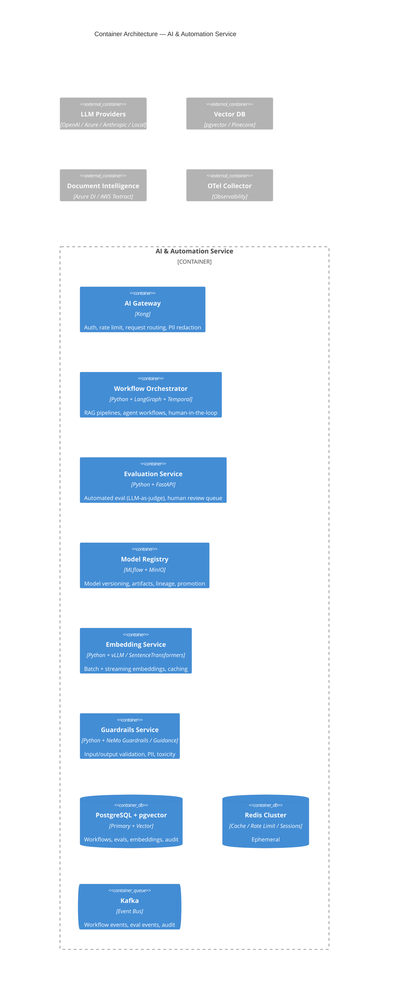
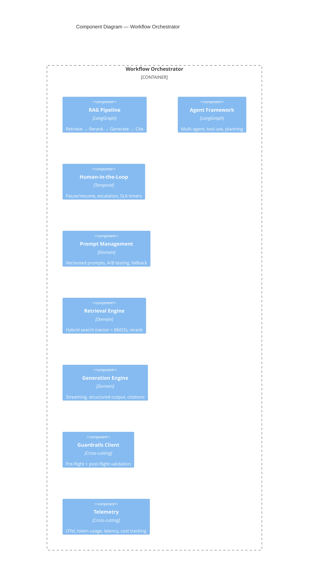
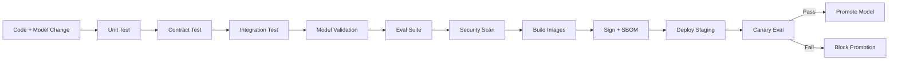

# Service Architecture: AI & Automation

**Slug**: `ai-automation`
**Primary Stack**: Python 3.11+, TypeScript 5, FastAPI, LangChain/LangGraph, PostgreSQL 16 + pgvector, Redis 7, Kafka, Kubernetes
**Team**: AI Platform

---

## 1. Domain Context

### Business Problem
AI experiments create value only when they fit real work, use trustworthy data, and can be evaluated. We design practical systems around measurable workflows.

### Target Personas
- **Product Teams** — embed AI in user-facing features
- **Operations** — automate document-heavy workflows
- **Data Teams** — govern AI/ML lifecycle

### Success Metrics
- Model latency P99 < 2s (inference)
- Evaluation pass rate > 90% before deploy
- Human-in-the-loop escalation < 5%
- Cost per 1k tokens < $0.01 (optimized)

---

## 2. System Context (C4 Level 1)

```mermaid
C4Context
title System Context — AI & Automation Service

Person(user, "End User", "Interacts with AI features")
Person(ops, "Operations Team", "Reviews human-in-the-loop tasks")
System_Boundary(boundary, "AI & Automation Service") {
    System(api_gw, "AI Gateway", "Kong + Auth + Rate Limit")
    System(orchestrator, "Orchestrator", "LangGraph / Temporal — Workflow execution")
    System(eval, "Evaluation Service", "Python — Automated + Human eval")
    System(registry, "Model Registry", "MLflow — Model versioning, artifacts")
}
System_Ext(llm, "LLM Providers", "OpenAI, Azure OpenAI, Anthropic, Local (vLLM/Ollama)")
System_Ext(vector_db, "Vector DB", "pgvector / Pinecone / Weaviate")
System_Ext(doc_intel, "Document Intelligence", "Azure Document Intelligence / AWS Textract")
System_Ext(kafka, "Kafka", "Event bus")
System_Ext(postgres, "PostgreSQL + pgvector", "Persistence, embeddings")
System_Ext(redis, "Redis", "Cache, sessions, rate limit")
System_Ext(otel, "OTel Collector", "Observability")

Rel(user, api_gw, "HTTPS / REST + SSE")
Rel(ops, api_gw, "HTTPS / Review UI")
Rel(api_gw, orchestrator, "gRPC / REST")
Rel(orchestrator, llm, "HTTPS / SDK")
Rel(orchestrator, vector_db, "SQL / gRPC")
Rel(orchestrator, doc_intel, "HTTPS")
Rel(orchestrator, eval, "Async events")
Rel(orchestrator, registry, "Model loading")
Rel(orchestrator, kafka, "Workflow events")
Rel(eval, registry, "Model metrics")
Rel(eval, kafka, "Evaluation events")
Rel(registry, postgres, "Metadata")
Rel(registry, s3, "Model artifacts")
```

### External Dependencies
| Dependency | Type | Fallback |
|------------|------|----------|
| OpenAI / Azure OpenAI | REST | Multi-provider router, local vLLM |
| Vector DB | pgvector / Pinecone | Read replica, cached embeddings |
| Document Intelligence | Azure / AWS | Local OCR (Tesseract) + layout |
| MLflow | REST | Local file store |

---

## 3. Container Architecture (C4 Level 2)



### Communication Protocols
| Path | Protocol | Pattern |
|------|----------|---------|
| Gateway → Orchestrator | gRPC + REST | Sync + Streaming (SSE) |
| Orchestrator → LLM | HTTPS (SDK) | Async streaming |
| Orchestrator → Vector DB | pgvector SQL / gRPC | Sync |
| Orchestrator → Guardrails | gRPC | Sync (pre/post) |
| Orchestrator → Evaluation | Kafka events | Async |
| Evaluation → Registry | REST | Async metrics push |

---

## 4. Component Design — Orchestrator



### Core Workflows
| Workflow | Description | Key Components |
|----------|-------------|----------------|
| **RAG Query** | Question → Retrieve → Rerank → Generate → Cite | rag_pipeline, retrieval, generation |
| **Document Intelligence** | Upload → Extract → Classify → Enrich → Index | doc_intel, embedding_svc, vector_db |
| **Agent Task** | Goal → Plan → Act (tools) → Observe → Complete | agent_framework, hitl |
| **Batch Evaluation** | Dataset → Generate → Auto-eval → Human review → Promote | eval_svc, model_reg |

### API Contracts
- **RAG**: `POST /v1/rag/query` (streaming SSE), `POST /v1/rag/index`
- **Agents**: `POST /v1/agents/tasks`, `GET /v1/agents/tasks/{id}/events` (SSE)
- **Documents**: `POST /v1/documents/ingest`, `GET /v1/documents/{id}/status`
- **Evaluation**: `POST /v1/eval/runs`, `POST /v1/eval/reviews/{id}/decision`
- **Models**: `GET/POST /v1/models`, `POST /v1/models/{id}/promote`

---

## 5. Data Architecture

### Vector Storage (pgvector)
```sql
-- Embeddings table with HNSW index
CREATE TABLE document_chunks (
    id UUID PRIMARY KEY DEFAULT gen_random_uuid(),
    tenant_id UUID NOT NULL,
    document_id UUID NOT NULL,
    chunk_index INT NOT NULL,
    content TEXT NOT NULL,
    embedding VECTOR(1536), -- OpenAI text-embedding-3-small
    metadata JSONB DEFAULT '{}',
    created_at TIMESTAMPTZ DEFAULT now()
);

CREATE INDEX ON document_chunks USING hnsw (embedding vector_cosine_ops)
    WITH (m = 16, ef_construction = 64);
```

### Evaluation Data Model
```sql
CREATE TABLE eval_runs (
    id UUID PRIMARY KEY DEFAULT gen_random_uuid(),
    tenant_id UUID NOT NULL,
    model_version VARCHAR(100) NOT NULL,
    dataset_id UUID NOT NULL,
    config JSONB NOT NULL, -- eval criteria, judges
    status VARCHAR(20) NOT NULL, -- running, completed, failed
    aggregate_metrics JSONB, -- pass_rate, avg_score, etc.
    created_at TIMESTAMPTZ DEFAULT now(),
    completed_at TIMESTAMPTZ
);

CREATE TABLE eval_samples (
    id UUID PRIMARY KEY DEFAULT gen_random_uuid(),
    run_id UUID NOT NULL REFERENCES eval_runs(id),
    input JSONB NOT NULL,
    expected JSONB,
    actual JSONB NOT NULL,
    scores JSONB NOT NULL, -- {criteria: score}
    judge_reasoning TEXT,
    human_review_id UUID, -- nullable, links to review queue
    created_at TIMESTAMPTZ DEFAULT now()
);
```

### Data Ownership
| Entity | Owner | Consumers |
|--------|-------|-----------|
| Workflows | Orchestrator | Gateway, Evaluation |
| Embeddings | Embedding Service | Orchestrator, Retrieval |
| Eval Runs | Evaluation Service | Model Registry, Dashboard |
| Model Artifacts | Model Registry | Orchestrator, Evaluation |

---

## 6. Infrastructure Requirements

### Compute Profiles
| Component | Profile | GPU | Scaling |
|-----------|---------|-----|---------|
| Orchestrator | 4 vCPU / 16 GiB | No | HPA: queue depth |
| Embedding Service | 8 vCPU / 32 GiB | Optional (A10G) | KEDA: batch queue |
| Generation (local LLM) | 16 vCPU / 64 GiB | Yes (H100/A100) | KEDA: concurrent requests |
| Evaluation | 4 vCPU / 8 GiB | No | KEDA: eval queue |
| Guardrails | 2 vCPU / 4 GiB | No | HPA: RPS |

### LLM Provider Strategy
| Tier | Provider | Use Case | Cost Control |
|------|----------|----------|--------------|
| **Primary** | Azure OpenAI (GPT-4o) | Production RAG, agents | Token budgets, caching |
| **Specialized** | Anthropic (Claude 3.5) | Code, long context | Per-request routing |
| **Local** | vLLM (Llama 3.1 70B) | High-volume, privacy | GPU pool, auto-scale |
| **Embeddings** | text-embedding-3-small (Azure) | All vectorization | Batch, cache aggressively |

### Guardrails Architecture
```
Request → Input Guardrails → LLM → Output Guardrails → Response
              ↓                    ↓
         Block/Redact         Validate/Transform
         (PII, toxicity,      (Schema, citations,
         prompt injection)     groundedness)
```

### Observability (AI-Specific)
| Metric | Target |
|--------|--------|
| Token latency P99 | < 2s (streaming first token < 500ms) |
| Embedding batch throughput | > 1000 docs/min |
| Evaluation throughput | > 100 samples/min |
| Guardrails overhead | < 50ms P99 |
| Hallucination rate (eval) | < 2% |
| Human escalation rate | < 5% |

### Alert Rules
| Alert | Condition |
|-------|-----------|
| HighLLMLatency | P99 > 5s for 5m |
| HighTokenCost | Daily cost > budget * 1.2 |
| EvaluationBacklog | Queue > 500 for 15m |
| GuardrailsRejectionRate | > 10% for 10m |
| HumanEscalationSLA | HITL task > 30min unassigned |

---

## 7. Security & Compliance

### AI-Specific Threats
| Threat | Mitigation |
|--------|------------|
| Prompt Injection | Input guardrails, instruction hierarchy, delimiters |
| Data Exfiltration | Output guardrails (PII, secrets), allowlist domains |
| Model Poisoning | Signed model artifacts, SBOM, provenance |
| Hallucination | Citations required, groundedness scoring, human review |
| Bias/Discrimination | Evaluation datasets with demographic splits, fairness metrics |

### Compliance
- **EU AI Act** — High-risk AI system classification; conformity assessment
- **SOC2** — Model versioning, evaluation audit trail, access control
- **HIPAA** (if healthcare) — BAA with LLM providers, zero-retention endpoints
- **Data Residency** — Local LLM deployment option for sovereign clouds

---

## 8. CI/CD Pipeline (AI/ML)



### AI-Specific Stages
| Stage | Tools | Gate |
|-------|-------|------|
| Model Validation | MLflow `mlflow models validate` | Schema, signature, dependencies |
| Eval Suite | Custom + `pytest` | Pass rate > 90%, no regression |
| Red Team | Garak, PromptFoo | No Critical findings |
| Bias/Fairness | AIF360, Fairlearn | Demographic parity < 10% diff |
| Cost Estimate | Token counter + pricing | < Budget threshold |

---

## 9. Operational Runbooks

| Incident | Mitigation |
|----------|------------|
| LLM provider outage | Failover to secondary provider / local vLLM; circuit breaker |
| High hallucination rate | Rollback model version; increase retrieval k; enable stricter guardrails |
| Evaluation backlog | Scale evaluation workers; prioritize human reviews; auto-approve low-risk |
| Guardrails false positives | Tune rules; add allowlist; shadow mode for new rules |
| GPU OOM | Reduce batch size; enable gradient checkpointing; scale GPU nodes |

---

*Architecture Review Board approved: 2026-08-16. Next review: 2026-11-16.*