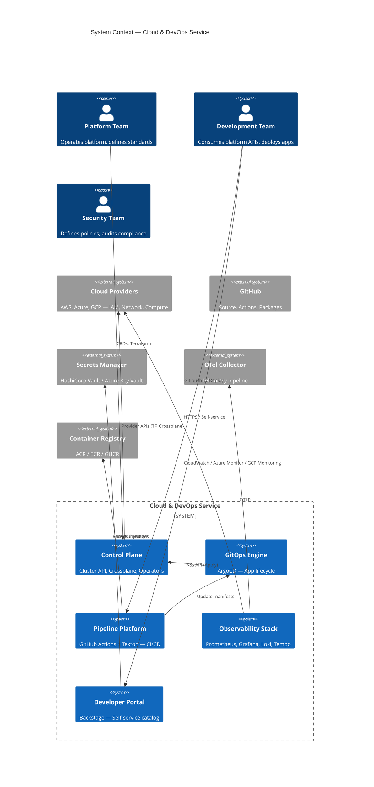
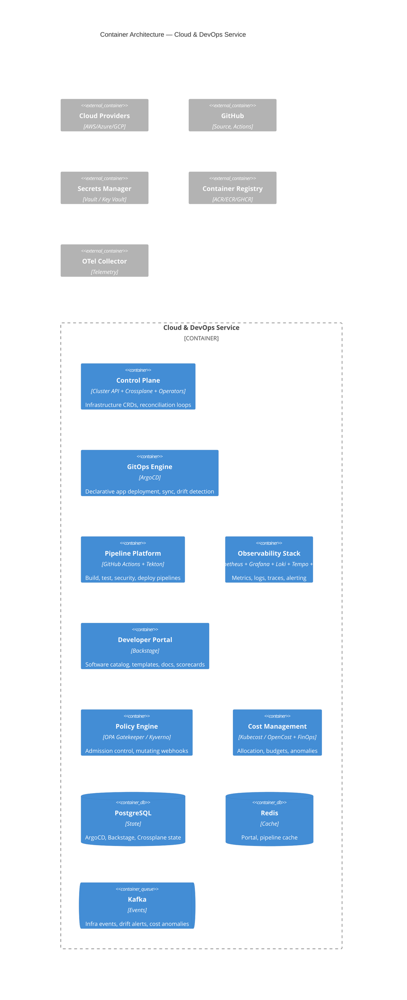
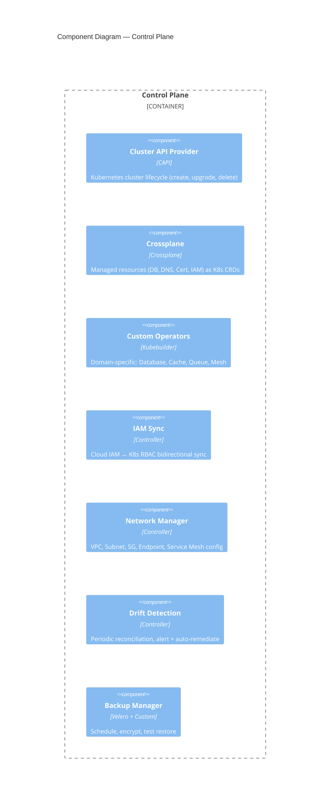

# Service Architecture: Cloud & DevOps

**Slug**: `cloud-devops`
**Primary Stack**: Go, Terraform, Helm, Kubernetes (EKS/AKS/GKE), ArgoCD, Prometheus/Grafana/Loki/Tempo, OpenTelemetry
**Team**: Platform Engineering

---

## 1. Domain Context

### Business Problem
Cloud value disappears when environments drift, releases stay manual, and failures are hard to diagnose. We create repeatable platforms that teams can operate confidently.

### Target Personas
- **Platform Teams** — need self-service infrastructure
- **Development Teams** — need reliable CI/CD, environments
- **Security/Compliance** — need guardrails, audit trails

### Success Metrics
- Environment provisioning: < 30 min (new), < 5 min (existing)
- Deployment lead time: < 15 min (code → prod)
- Infrastructure drift: 0 (auto-remediated)
- Incident MTTR: < 15 min

---

## 2. System Context (C4 Level 1)



---

## 3. Container Architecture (C4 Level 2)



---

## 4. Component Design — Control Plane



### Infrastructure as Code Standards
| Layer | Tool | Pattern |
|-------|------|---------|
| **Account/Org** | Terraform (Terragrunt) | Root modules per environment |
| **Network** | Terraform + Crossplane | VPC, Subnet, TGW, Endpoints as CRDs |
| **Cluster** | Cluster API (CAPI) | Cluster, MachineDeployment, KubeadmControlPlane |
| **Add-ons** | Helm + Kustomize | ArgoCD, Cert-Manager, ExternalDNS, CSI drivers |
| **Workloads** | Crossplane Compositions | XRDs → Composed resources (RDS, Redis, Bucket) |
| **Policy** | OPA Gatekeeper | Constraints, ConstraintsTemplates, Audit |

---

## 5. Data Architecture

### Crossplane Resource Model
```yaml
# Example: PostgreSQL Instance as Crossplane XR
apiVersion: database.example.org/v1alpha1
kind: PostgreSQLInstance
metadata:
  name: orders-db
  namespace: production
spec:
  parameters:
    engineVersion: "16"
    instanceClass: "db.r6g.xlarge"
    storageGB: 500
    backupRetentionDays: 30
    deletionProtection: true
  writeConnectionSecretToRef:
    name: orders-db-credentials
```

### State Storage
| Data | Store | Backup |
|------|-------|--------|
| ArgoCD Applications/Projects | PostgreSQL (managed) | Daily + Git backup |
| Backstage Catalog | PostgreSQL | Daily |
| Crossplane State | etcd (K8s) | Velero |
| Cluster API State | etcd (management cluster) | Velero |
| Pipeline Runs | Tekton Chains + Tekton Results | PostgreSQL |
| Cost Allocation | PostgreSQL (OpenCost) | Daily |

---

## 6. Infrastructure Requirements

### Landing Zone (per Cloud)
```
Management Account
├── Audit (Security Hub, CloudTrail, Config)
├── Log Archive (S3 + Athena / Log Analytics)
├── Network Hub (TGW, Firewall, DNS, VPN)
└── Shared Services (AD, Vault, Registry, Monitoring)

Workload Accounts (per environment)
├── Network (VPC, Subnets, NAT, Endpoints)
├── Compute (EKS/AKS/GKE Clusters via CAPI)
├── Data (RDS, ElastiCache, DocumentDB via Crossplane)
├── Security (GuardDuty, Security Hub, Config)
└── Operations (SSM, Systems Manager, Backup)
```

### Kubernetes Cluster Spec
| Component | Spec |
|-----------|------|
| **Control Plane** | Managed (EKS/AKS/GKE) — 3 AZ, private endpoint |
| **Node Pools** | System (Critical), General, GPU, Memory-Optimized, Spot |
| **CNI** | VPC-CNI (AWS) / Azure CNI / GKE Dataplane V2 |
| **CSI** | EBS / Azure Disk / GCP PD + S3/GCS/Filer for shared |
| **Ingress** | ALB Controller / AGIC / GKE Ingress + ExternalDNS |
| **Service Mesh** | Istio (ambient) / Linkerd — mTLS, traffic split |
| **Policy** | Gatekeeper + Kyverno — constraints, mutation |
| **GitOps** | ArgoCD (App of Apps) — root app per environment |

### Observability Stack
| Component | Version | Retention |
|-----------|---------|-----------|
| Prometheus | 2.48+ | 15d (local), 13mo (remote write → Thanos/Grafana Cloud) |
| Grafana | 10+ | Dashboards as Code (JSONNet) |
| Loki | 2.9+ | 30d (local), 13mo (S3) |
| Tempo | 2.4+ | 30d (local), 13mo (S3) |
| OTel Collector | 0.100+ | DaemonSet + Deployment |
| Alertmanager | 0.26+ | Routes → PagerDuty / Opsgenie / Slack |

---

## 7. Security & Compliance

### Zero Trust Network
- **No default allow** — all traffic denied unless explicit policy
- **Service mesh mTLS** — STRICT mode, workload identity (SPIFFE)
- **Egress control** — allowlist domains/IPs via firewall / mesh EgressGateway
- **Micro-segmentation** — NetworkPolicy + Cilium/Calico per namespace

### Policy as Code (Examples)
```rego
# Deny containers running as root
package kubernetes.admission

deny[msg] {
    input.request.kind.kind == "Pod"
    container := input.request.object.spec.containers[_]
    container.securityContext.runAsUser == 0
    msg := "Container must not run as root"
}

# Require resource limits
deny[msg] {
    input.request.kind.kind == "Pod"
    container := input.request.object.spec.containers[_]
    not container.resources.limits.memory
    msg := "Container must have memory limit"
}
```

### Compliance Mapping
| Standard | Controls | Automation |
|----------|----------|------------|
| SOC2 CC6.1 | mTLS, cert rotation, network segmentation | Gatekeeper, Cert-Manager |
| SOC2 CC7.2 | Drift detection, auto-remediation | Crossplane, drift controller |
| ISO 27001 A.12.5 | Vulnerability scanning, patch management | Trivy, Kyverno, Node Auto-Upgrade |
| CIS Kubernetes | Benchmark compliance | kube-bench, Polaris, Gatekeeper |

---

## 8. CI/CD Pipeline Platform

### Pipeline Templates (Tekton + GitHub Actions)
```yaml
# .github/workflows/ci.yaml — Reusable workflow
name: CI
on: [push, pull_request]
jobs:
  build-test:
    uses: ./.github/workflows/reusable-build-test.yaml
    secrets: inherit
  security-scan:
    uses: ./.github/workflows/reusable-security.yaml
    secrets: inherit
  contract-test:
    uses: ./.github/workflows/reusable-contract.yaml
    secrets: inherit
```

### GitOps Promotion Flow
```
┌─────────────┐     ┌─────────────┐     ┌─────────────┐
│   Staging   │────▶│  Canary     │────▶│  Production │
│   (auto)    │     │  (analysis) │     │  (manual)   │
└─────────────┘     └─────────────┘     └─────────────┘
       │                   │                   │
       ▼                   ▼                   ▼
  ArgoCD sync         Flagger/Argo        GitOps PR
  on merge            Rollouts            approval
```

### Pipeline Stages & Gates
| Stage | Tools | Gate Criteria |
|-------|-------|---------------|
| Lint/Typecheck | hadolint, checkov, tflint, golangci-lint | Zero errors |
| Unit Test | go test, pytest | >80% coverage |
| Security Scan | Trivy (fs, image, config), Checkov, tfsec | No Critical |
| Integration Test | Kind + Testcontainers | All pass |
| Build Image | BuildKit + cosign | SBOM, signed, SLSA L3 |
| Deploy Staging | ArgoCD | Health checks, smoke tests |
| E2E Test | k6, Playwright | Critical paths pass |
| Canary Deploy | Flagger + Prometheus | SLO met, error budget > 0 |
| Prod Promote | GitOps PR + ArgoCD | Manual approval, rollback < 2min |

---

## 9. Operational Runbooks

| Incident | Runbook |
|----------|---------|
| Cluster API reconciliation stuck | `runbook-capi-stuck` — check CAPI controller logs, machine status, cloud provider quotas |
| Crossplane resource drift | `runbook-crossplane-drift` — `kubectl crossplane beta trace`, force reconcile |
| ArgoCD sync stuck | `runbook-argocd-sync-stuck` — check resource health, resource hooks, resource limits |
| Certificate expiration | `runbook-cert-expiry` — cert-manager status, renew, verify DNS challenge |
| Node pool scale failure | `runbook-nodepool-scale` — check cloud quotas, instance availability, CAPI machine status |
| Cost anomaly | `runbook-cost-anomaly` — Kubecost breakdown, identify namespace/workload, rightsize |

### Disaster Recovery
| Scenario | RPO | RTO | Procedure |
|----------|-----|-----|-----------|
| Management cluster loss | < 5 min | < 30 min | Velero restore to standby management cluster, DNS update |
| Workload cluster loss | < 5 min | < 15 min | CAPI reprovision from GitOps, Crossplane reconcile |
| Regional outage | < 5 min | < 30 min | Failover to paired region (TGW, Crossplane multi-region) |
| Data corruption (RDS) | < 1 hr | < 2 hr | PITR, Crossplane re-provision, Velero restore K8s state |

---

## 10. Developer Portal (Backstage)

### Catalog Entities
| Kind | Description | Example |
|------|-------------|---------|
| **Component** | Service, library, website | `orders-api`, `frontend` |
| **API** | OpenAPI/AsyncAPI spec | `orders-api-v1` |
| **Resource** | Infrastructure | `orders-db`, `orders-cache` |
| **System** | Business domain | `order-management` |
| **Domain** | Organizational boundary | `platform`, `commerce` |

### Software Templates (Scaffolder)
| Template | Output |
|----------|--------|
| **New Service** | Go/Node/.NET repo + CI + ArgoCD app + Helm chart + Observability |
| **New Library** | Shared package + CI + Release workflow |
| **New Infrastructure** | Crossplane Composition + CRD + Controller scaffold |
| **New Pipeline** | Tekton Pipeline + GitHub Actions + Policies |

### Scorecards (Tech Health)
| Check | Weight | Threshold |
|-------|--------|-----------|
| Has CI/CD | 20% | Pass |
| Has Monitoring | 20% | Dashboards + Alerts |
| Has Documentation | 15% | README + ADRs |
| Security Scan Clean | 20% | No Critical |
| Dependency Freshness | 15% | < 30 days behind |
| Test Coverage | 10% | > 80% |

---

*Architecture Review Board approved: 2026-08-16. Next review: 2026-11-16.*