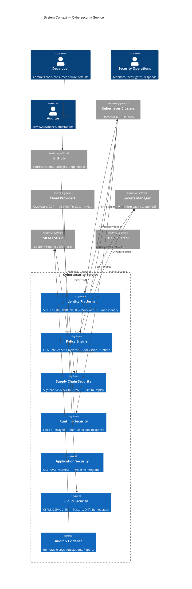
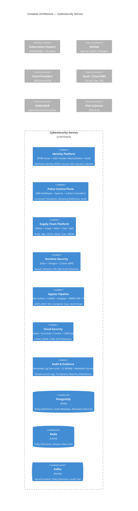
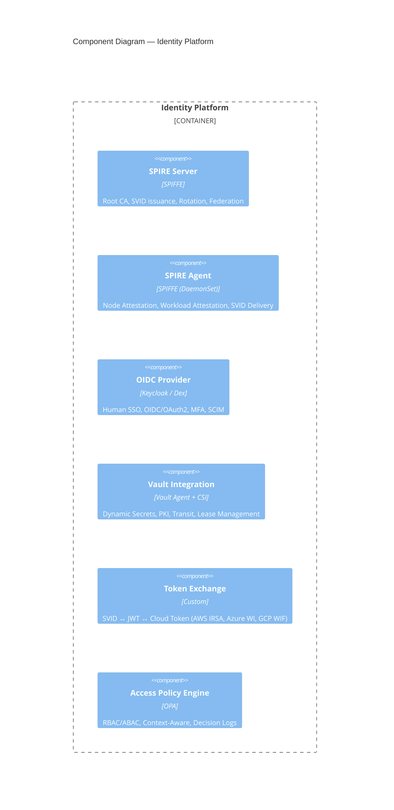
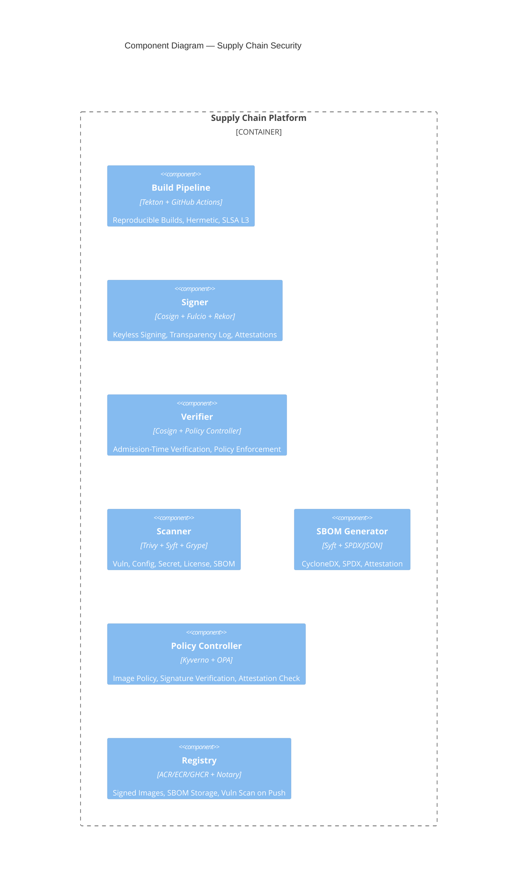
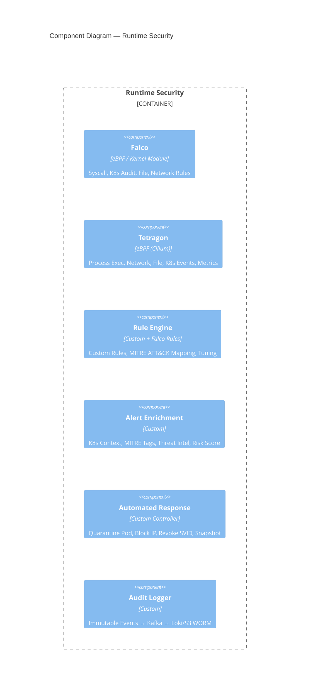

# Service Architecture: Cybersecurity

**Slug**: `cybersecurity`
**Primary Stack**: Go, Python, TypeScript, OpenPolicyAgent, Falco, Trivy, HashiCorp Vault, SPIFFE/SPIRE, Kubernetes
**Team**: Security Platform

---

## 1. Domain Context

### Business Problem
Security bolted on after delivery becomes expensive friction. We integrate practical controls into architecture, identity, code, and production operations.

### Target Personas
- **Development Teams** — need secure defaults, guardrails, self-service
- **Security Engineers** — need centralized policy, detection, response
- **Compliance/Audit** — need evidence, reports, attestations
- **Platform Team** — need infrastructure security, supply chain

### Success Metrics
- Mean Time to Detect (MTTD): < 15 min
- Mean Time to Respond (MTTR): < 1 hr
- Vulnerability remediation SLA: Critical < 24h, High < 7d
- Policy compliance: > 99.5% across fleet
- Zero critical supply chain incidents

---

## 2. System Context (C4 Level 1)



---

## 3. Container Architecture (C4 Level 2)



---

## 4. Component Design — Identity Platform



### Identity Flow (Workload)
```
Pod Start
    │
    ▼
SPIRE Agent (Node Attestation: Join Token / Cloud Identity)
    │
    ▼
Workload Attestation (K8s PSAT / Selector)
    │
    ▼
SPIRE Server → Issues X.509-SVID (Short-lived, Auto-Rotate)
    │
    ▼
CSI Driver / Sidecar → Mounts SVID + Key + Bundle to Pod
    │
    ▼
Application Uses SVID for:
  • mTLS (SPIFFE ID as SNI/URI)
  • JWT-SVID for API Auth (Token Exchange)
  • Vault Auth (Kubernetes Auth Method)
```

---

## 5. Component Design — Supply Chain Security



### SLSA Level 3 Implementation
| Requirement | Implementation |
|-------------|----------------|
| **Build Service** | Tekton on isolated nodes, hermetic, reproducible |
| **Provenance** | SLSA Provenance v1 (intoto) via `slsa-framework/slsa-github-generator` |
| **Signing** | Cosign keyless (Fulcio OIDC) → Rekor transparency log |
| **Verification** | Policy Controller (Kyverno) verifies: signature, provenance, Rekor inclusion, digest match |
| **SBOM** | Syft generates CycloneDX + SPDX; attached as Cosign attestation |

---

## 6. Component Design — Runtime Security (Falco + Tetragon)



### Detection Rules (MITRE ATT&CK Mapped)
| Rule | Technique | Action |
|------|-----------|--------|
| `exec_shell_in_container` | T1059 | Alert + Quarantine |
| `k8s_secret_access` | T1552 | Alert + Audit |
| `privilege_escalation` | T1068 | Alert + Quarantine + Revoke SVID |
| `crypto_miner` | T1496 | Alert + Kill Process |
| `reverse_shell` | T1059.004 | Alert + Block Network |
| `sensitive_file_read` | T1005 | Alert + Audit |

---

## 7. Data Architecture

### Policy as Data (OPA)
```rego
# Admission Control: Deny privileged containers
package kubernetes.admission

deny[msg] {
    input.request.kind.kind == "Pod"
    container := input.request.object.spec.containers[_]
    container.securityContext.privileged == true
    msg := "Privileged containers are not allowed"
}

# Mutation: Add security context defaults
patch[op] {
    input.request.kind.kind == "Pod"
    not input.request.object.spec.securityContext.runAsNonRoot
    op := {"op": "add", "path": "/spec/securityContext/runAsNonRoot", "value": true}
}
```

### Audit Data Model
```sql
CREATE TABLE security_events (
    id UUID PRIMARY KEY DEFAULT gen_random_uuid(),
    tenant_id UUID NOT NULL,
    event_type VARCHAR(100) NOT NULL, -- POLICY_DENY, RUNTIME_ALERT, SCAN_FINDING, ATTESTATION
    severity VARCHAR(20) NOT NULL, -- CRITICAL, HIGH, MEDIUM, LOW
    source VARCHAR(50) NOT NULL, -- OPA, FALCO, TRIVY, COSIGN, CSPM
    resource_ref JSONB, -- {kind, namespace, name, uid}
    mitre_techniques TEXT[], -- ['T1059', 'T1068']
    risk_score INT, -- 0-100
    raw_event JSONB NOT NULL,
    created_at TIMESTAMPTZ DEFAULT now()
);

CREATE INDEX ON security_events (tenant_id, created_at DESC);
CREATE INDEX ON security_events (severity, created_at DESC);
```

---

## 7. Infrastructure Requirements

### Deployment Model
| Component | Deployment | HA |
|-----------|------------|----|
| SPIRE Server | StatefulSet (3 replicas) | Leader election |
| SPIRE Agent | DaemonSet (per node) | N/A |
| OPA Gatekeeper | Deployment (3 replicas) | Leader election (audit) |
| Kyverno | Deployment (3 replicas) | Leader election |
| Falco | DaemonSet | Per node |
| Tetragon | DaemonSet | Per node |
| Policy Controller | Deployment | Leader election |
| Vault | StatefulSet (3+5) | Raft consensus |

### Network Policies (Default Deny)
```yaml
# Default deny all ingress/egress
apiVersion: networking.k8s.io/v1
kind: NetworkPolicy
metadata:
  name: default-deny-all
spec:
  podSelector: {}
  policyTypes: [Ingress, Egress]
---
# Allow DNS
apiVersion: networking.k8s.io/v1
kind: NetworkPolicy
metadata:
  name: allow-dns
spec:
  podSelector: {}
  policyTypes: [Egress]
  egress:
  - to:
    - namespaceSelector: {matchLabels: {kubernetes.io/metadata.name: kube-system}}
    ports:
    - protocol: UDP
      port: 53
```

---

## 8. Security & Compliance (Meta-Security)

### Threat Model (Security Platform Itself)
| Threat | Mitigation |
|--------|------------|
| Compromised SPIRE Server | Hardware-rooted CA, offline root, short-lived intermediates |
| Policy bypass | Mutation + Validation webhooks, audit logging, break-glass only with MFA |
| Supply chain compromise | SLSA L3, Rekor transparency, keyless signing, policy enforcement at deploy |
| Runtime sensor tampering | Kernel module integrity (IMA), eBPF verifier, immutable containers |
| Audit log tampering | S3 Object Lock (WORM), CloudTrail, signed attestations |

### Compliance Automation
| Standard | Automation |
|----------|------------|
| **SOC2 Type II** | Continuous control monitoring (policy compliance %, scan coverage, incident MTTR) |
| **ISO 27001** | Annex A control mapping → OPA policies, automated evidence collection |
| **NIST 800-53** | Control implementation → Kyverno/Falco rules, automated assessment |
| **CIS Benchmarks** | kube-bench + Gatekeeper constraints, daily scan, auto-remediate |
| **PCI DSS** | Network segmentation (CNI + NetworkPolicy), encryption, vulnerability management |
| **FedRAMP** | FedRAMP-authorized services only, FIPS 140-2 crypto, continuous monitoring |

---

## 9. CI/CD Security Gates

```mermaid
graph LR
    A[Code Commit] --> B[Secret Scan]
    B --> C[SAST: CodeQL + Semgrep]
    C --> D[SCA: Trivy + Dependabot]
    D --> E[Container Build]
    E --> F[Container Scan: Trivy + Grype]
    F --> G[SBOM Generate: Syft]
    G --> H[Sign: Cosign]
    H --> I[Attest: SLSA Provenance]
    I --> J[Verify: Policy Controller]
    J --> K[Deploy Staging]
    K --> L[DAST: ZAP]
    L --> M[Runtime Policy Test]
    M --> N[Promote]
```



### Gate Thresholds (Blocking)
| Gate | Tool | Fail Criteria |
|------|------|---------------|
| Secret Scan | TruffleHog / Gitleaks | Any secret |
| SAST | CodeQL + Semgrep | Critical/High (configurable) |
| SCA | Trivy + Dependabot | Critical vuln in direct dep |
| Container Scan | Trivy + Grype | Critical/High in base image |
| SBOM | Syft | Generation failure |
| Signing | Cosign | Signature missing/invalid |
| SLSA Provenance | slsa-verifier | Level < 3 |
| Policy Verify | Kyverno + OPA | Any constraint violation |

---

## 10. Operational Runbooks

| Incident | Runbook |
|----------|---------|
| SPIRE Server down | `runbook-spire-down` — check leader, restart follower, check etcd/Raft |
| Policy admission webhook timeout | `runbook-opa-timeout` — scale Gatekeeper, check constraint complexity, increase timeout |
| Falco/Tetragon alert storm | `runbook-runtime-storm` — tune rules, add allowlist, check for actual compromise |
| Image deploy blocked | `runbook-image-blocked` — verify signature, check Rekor, scan results, emergency break-glass |
| Certificate expiry (SPIRE/Vault) | `runbook-cert-expiry` — check rotation status, manual rotate if stuck |
| Cloud posture drift | `runbook-cloud-drift` — Prowler scan, identify drifted resources, auto-remediate or ticket |
| Supply chain compromise suspected | `runbook-supply-chain-compromise` — verify Rekor, check SBOM, isolate affected images, rotate keys |

### Disaster Recovery
| Scenario | RPO | RTO | Procedure |
|----------|-----|-----|-----------|
| SPIRE CA compromise | 0 | < 1 hr | Revoke intermediate, rotate root (offline), re-issue all SVIDs |
| Policy engine OOM/crash | < 1 min | < 5 min | HPA scale, fallback to fail-open (audit only) with alert |
| Runtime sensor gap | < 5 min | < 15 min | DaemonSet restart, check kernel compatibility, fallback to audit logs |
| Vault unseal failure | 0 | < 30 min | Shamir shares, DR cluster, manual unseal procedure |

---

*Architecture Review Board approved: 2026-08-16. Next review: 2026-11-16.*