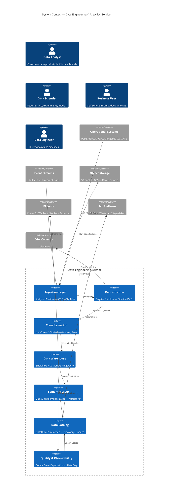
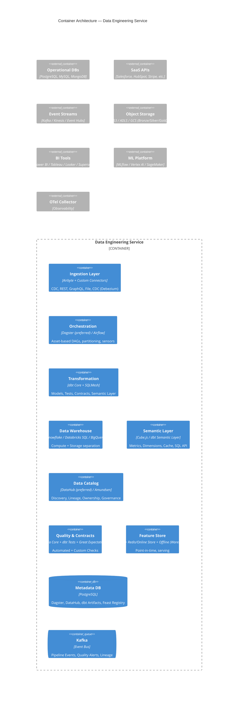
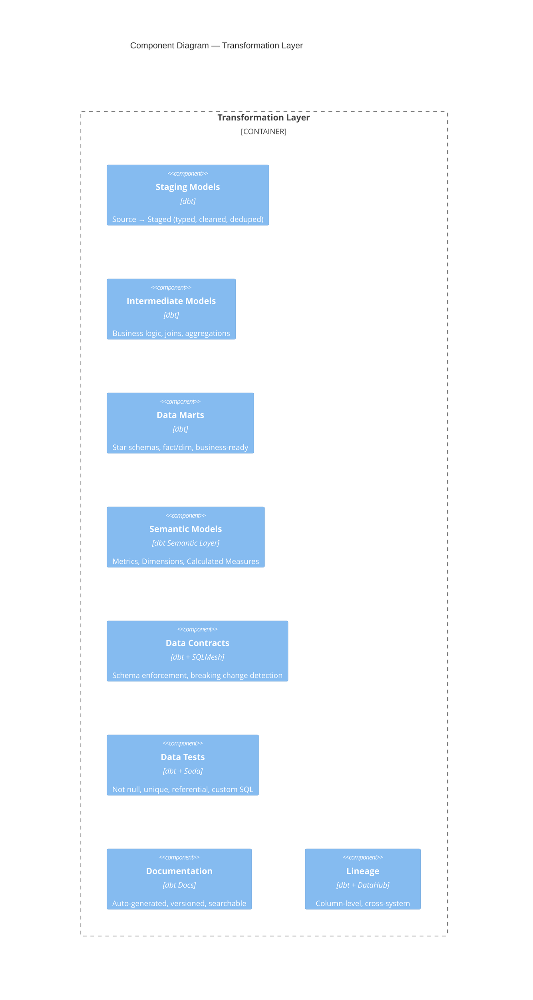

# Service Architecture: Data Engineering & Analytics

**Slug**: `data-engineering`
**Primary Stack**: Python 3.11+, SQL, dbt, Airflow/Dagster, PostgreSQL 16, Snowflake/Databricks/BigQuery, Kafka, Kubernetes
**Team**: Data Platform

---

## 1. Domain Context

### Business Problem
Reports lose trust when definitions conflict and pipelines break silently. We build governed data products that connect operational sources to useful decisions.

### Target Personas
- **Data Analysts** — need trusted, documented datasets
- **Data Scientists** — need feature stores, experiment tracking
- **Business Users** — need self-service BI, embedded analytics
- **Data Engineers** — need reliable pipelines, observability

### Success Metrics
- Data freshness SLA: < 15 min (operational), < 4 hr (analytical)
- Pipeline reliability: > 99.5% success rate
- Time to new data product: < 2 weeks
- Data quality incidents: < 1/month (P1)

---

## 2. System Context (C4 Level 1)



---

## 3. Container Architecture (C4 Level 2)



---

## 4. Component Design — Transformation Layer (dbt + SQLMesh)



### dbt Project Structure
```
models/
├── staging/           # Source → Staged (1:1)
│   ├── src_salesforce/
│   ├── src_postgres/
│   └── src_kafka/
├── intermediate/      # Business logic, reusable
│   ├── finance/
│   ├── marketing/
│   └── product/
├── marts/             # Star schemas, business-ready
│   ├── core/          # Conformed dimensions, facts
│   ├── finance/
│   ├── marketing/
│   └── product/
├── semantic/          # Metrics, dimensions (dbt Semantic Layer)
│   ├── metrics.yml
│   └── dimensions.yml
└── contracts/         # Data contracts (SQLMesh)
    └── schema_changes.yml
```

### Data Contracts (SQLMesh)
```yaml
# contracts/schema_changes.yml
models:
  - name: marts.core.fct_orders
    contract:
      schema:
        - name: order_id
          data_type: STRING
          constraints: [NOT NULL, UNIQUE]
        - name: customer_id
          data_type: STRING
          constraints: [NOT NULL]
        - name: order_total
          data_type: DECIMAL(12,2)
          constraints: [NOT NULL, CHECK(order_total >= 0)]
        - name: order_date
          data_type: DATE
          constraints: [NOT NULL]
      breaking_change_policy: ERROR
      evolution: BACKWARD_COMPATIBLE
```

---

## 5. Data Architecture

### Medallion Architecture (Bronze → Silver → Gold)
| Layer | Location | Format | Retention | Access |
|-------|----------|--------|-----------|--------|
| **Bronze** | Object Store (S3/ADLS) | Parquet / Iceberg / Delta | 7 years | Data Engineers only |
| **Silver** | Warehouse (Snowflake/Databricks) | Tables (Managed) | 7 years | Data Engineers, Analysts |
| **Gold** | Warehouse + Semantic Layer | Tables + Semantic Models | 7 years | Analysts, BI, Data Scientists |

### Data Products (Domain-Oriented)
| Data Product | Domain | Owner | SLA | Consumers |
|--------------|--------|-------|-----|-----------|
| `customer_360` | Customer | Marketing DE | 15 min | Marketing, Sales, Support |
| `order_facts` | Commerce | Commerce DE | 5 min | Finance, Ops, ML |
| `product_analytics` | Product | Product DE | 1 hr | Product, ML |
| `financial_ledger` | Finance | Finance DE | 4 hr | Finance, Audit |
| `marketing_attribution` | Marketing | Marketing DE | 1 hr | Marketing, Finance |

### Data Governance
| Aspect | Implementation |
|--------|----------------|
| **Ownership** | Every model has `owner` tag (team + Slack) |
| **Classification** | Tags: `PII`, `FINANCIAL`, `PUBLIC`, `INTERNAL` |
| **Access Control** | Row-level security (RLS) via dbt grants + warehouse roles |
| **Lineage** | Column-level (dbt + DataHub), cross-system (Airbyte → dbt → BI) |
| **Quality** | dbt tests (CI), Soda checks (runtime), Contracts (breaking change prevention) |
| **Retention** | Bronze: 7yr, Silver/Gold: 7yr, Ephemeral: 30d |

---

## 6. Infrastructure Requirements

### Warehouse Configuration
| Warehouse | Sizing | Scaling | Cost Control |
|-----------|--------|---------|--------------|
| **Snowflake** | XS-L per workload | Auto-scale (1-10), multi-cluster | Resource monitors, query timeout |
| **Databricks SQL** | Serverless / Pro | Auto-scale | Spot instances, auto-terminate |
| **BigQuery** | On-demand / Slots | Auto | Slot reservations, partition pruning |

### Orchestration (Dagster)
```python
# Asset-based pipeline example
@asset(
    partitions_def=DailyPartitionsDefinition(start_date="2024-01-01"),
    metadata={"dagster/partition_expr": "order_date"},
    io_manager_key="warehouse_io_manager"
)
def daily_order_facts(context) -> pd.DataFrame:
    partition_date = context.partition_key
    return fetch_and_transform(partition_date)

@asset_check(asset=daily_order_facts)
def check_row_count(daily_order_facts) -> AssetCheckResult:
    count = len(daily_order_facts)
    return AssetCheckResult(passed=count > 0, metadata={"row_count": count})
```

### Compute Profiles
| Component | Profile | Scaling |
|-----------|---------|---------|
| Dagster Daemon | 2 vCPU / 4 GiB | Fixed (HA pair) |
| Dagster Run Workers | 4 vCPU / 16 GiB | KEDA: queue depth |
| dbt Runtime | 4 vCPU / 8 GiB | Per-run pod (K8s Job) |
| Soda Checks | 2 vCPU / 4 GiB | Per-check pod |
| DataHub (GMS + Frontend) | 4 vCPU / 8 GiB | HPA: CPU > 70% |

---

## 7. Security & Compliance

### Data Protection
| Layer | Control |
|-------|---------|
| **Encryption at Rest** | Warehouse-managed (AES-256) + Customer-managed keys (CMK) |
| **Encryption in Transit** | TLS 1.3 everywhere (ingestion, warehouse, BI) |
| **PII Handling** | Tag-based masking (dbt tags + warehouse dynamic masking) |
| **Tokenization** | Vault tokenization for high-value PII (SSN, CC) |
| **Data Minimization** | Column pruning in staging; no raw PII in Silver/Gold |

### Access Control (Role-Based)
| Role | Warehouse Access | Catalog Access |
|------|------------------|----------------|
| **Data Engineer** | Read/Write (dev), Write (prod via CI) | Full |
| **Analyst** | Read (Silver/Gold) | Read + Annotate |
| **Data Scientist** | Read (Gold + Feature Store) | Read |
| **BI Service Account** | Read (Semantic Layer only) | None |
| **Auditor** | Read (Audit Logs) | Read |

### Compliance
| Standard | Implementation |
|----------|----------------|
| **GDPR** | Right to erasure (column-level delete + lineage), DPIA for new products |
| **CCPA** | Opt-out flag propagation, deletion workflows |
| **SOX** | Immutable audit trail (dbt artifacts + warehouse query history), change control |
| **HIPAA** | BAA with warehouse vendor, encryption, access logging, minimum necessary |
| **SOC2** | Pipeline reliability (SLOs), access review (quarterly), encryption |

---

## 8. Observability

### Pipeline SLIs/SLOs
| SLI | Target | Measurement |
|-----|--------|-------------|
| **Freshness** | < 15 min (operational), < 4 hr (analytical) | `max(event_time) - now()` per table |
| **Completeness** | > 99.9% rows vs source | Row counts + checksums |
| **Accuracy** | < 0.1% test failures | dbt test pass rate |
| **Latency** | P95 < 30 min (end-to-end) | Dagster asset materialization duration |

### Key Dashboards
- **Pipeline Health**: Asset status, duration, failure rate, backlog
- **Data Quality**: Test pass rate, anomaly count, contract violations
- **Freshness**: Per-table freshness, SLA compliance
- **Cost**: Warehouse compute, storage, network per domain
- **Lineage Impact**: Blast radius of upstream changes

### Alert Rules
| Alert | Condition | Severity |
|-------|-----------|----------|
| PipelineFailure | Any asset failed | Critical |
| FreshnessBreach | Freshness > SLA * 1.5 | Critical |
| QualityRegression | Test pass rate < 99% | Warning |
| ContractViolation | Breaking change detected | Critical |
| CostAnomaly | Daily cost > 1.5x baseline | Warning |

---

## 9. CI/CD for Data

```mermaid
graph LR
    A[PR: dbt/SQLMesh/Dagster] --> B[Lint + Parse]
    B --> C[Unit Tests (dbt)]
    C --> D[Compile + Contract Check]
    D --> E[Staging Deploy]
    E --> F[Run Staging Pipeline]
    F --> G[Data Quality Gates]
    G --> H[Merge → Prod Deploy]
    H --> I[Prod Pipeline Run]
```

### Quality Gates (Blocking)
| Gate | Tool | Threshold |
|------|------|-----------|
| **Schema Contracts** | SQLMesh | No breaking changes |
| **Data Tests** | dbt + Soda | 100% pass |
| **Row Counts** | Custom | > 0, within 20% of baseline |
| **Freshness** | Custom | Within SLA |
| **Anomaly Detection** | Soda / Custom | No P1 anomalies |

---

## 10. Operational Runbooks

| Incident | Runbook |
|----------|---------|
| Pipeline backlog | `runbook-pipeline-backlog` — check Dagster queue, scale workers, skip non-critical |
| Freshness breach | `runbook-freshness-breach` — identify stuck asset, check upstream, manual re-run |
| Data quality failure | `runbook-quality-failure` — Soda check details, quarantine affected marts, notify owners |
| Contract violation | `runbook-contract-violation` — block merge, coordinate with consumers, migration plan |
| Warehouse performance | `runbook-warehouse-perf` — query profile, clustering keys, materialized views, scaling |
| Cost spike | `runbook-cost-spike` — identify expensive queries, optimize, adjust warehouse size |

### Disaster Recovery
| Scenario | RPO | RTO | Procedure |
|----------|-----|-----|-----------|
| Warehouse outage | < 1 hr | < 4 hr | Failover to secondary region (Snowflake/Databricks), re-point semantic layer |
| Metadata DB loss | < 5 min | < 30 min | PITR PostgreSQL, re-sync DataHub/Dagster |
| Object store corruption | < 1 hr | < 2 hr | Versioned bucket restore, re-run Bronze→Silver |
| Lineage corruption | < 5 min | < 1 hr | Re-ingest dbt manifest to DataHub |

---

*Architecture Review Board approved: 2026-08-16. Next review: 2026-11-16.*