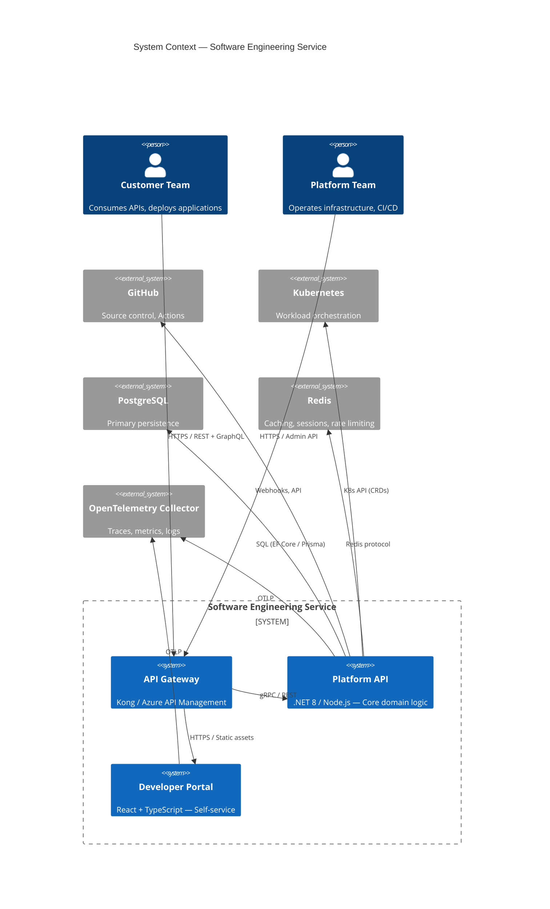
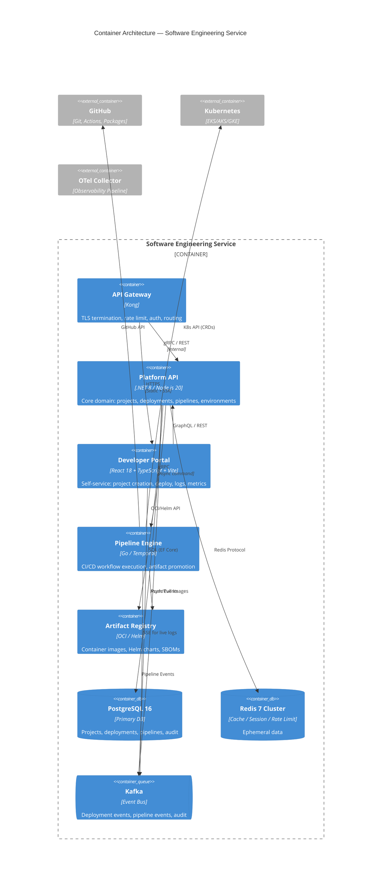
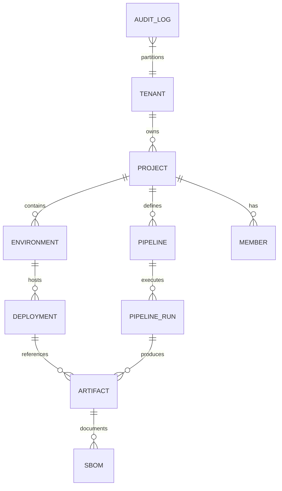
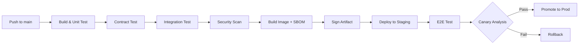

# Service Architecture: Software Engineering

**Slug**: `software-engineering`
**Primary Stack**: TypeScript, React, .NET 8, Node.js 20, PostgreSQL 16, Redis 7, Docker, Kubernetes
**Team**: Platform Engineering

---

## 1. Domain Context

### Business Problem
Organizations struggle with legacy constraints, fragmented systems, and unclear ownership that slow delivery. We turn product goals into maintainable software with clear boundaries and reliable delivery.

### Target Personas
- **Product Teams** — need reliable APIs and platforms
- **Engineering Leaders** — need modernization roadmaps
- **Operations** — need observable, debuggable systems

### Success Metrics
- Lead time for changes: < 1 day (P95)
- Deployment frequency: on-demand
- Change failure rate: < 5%
- MTTR: < 30 minutes

---

## 2. System Context (C4 Level 1)



### External Dependencies
| Dependency | Type | SLA | Fallback |
|------------|------|-----|----------|
| GitHub API | REST/GraphQL | 99.9% | Queue webhooks, retry |
| Kubernetes API | gRPC | 99.95% | Local cache, reconcile loop |
| PostgreSQL | SQL | 99.99% | Read replicas, connection pooling |
| Redis | In-memory | 99.9% | Local cache, circuit breaker |

### Data Classification
- **Source code** — Confidential (customer IP)
- **Deployment configs** — Internal
- **Telemetry** — Internal (PII scrubbed)
- **Audit logs** — Regulated (7-year retention)

---

## 3. Container Architecture (C4 Level 2)



### Communication Protocols
| Path | Protocol | Pattern |
|------|----------|---------|
| Gateway → Platform API | gRPC (primary), REST (webhooks) | Sync request/response |
| Platform API → Pipeline Engine | gRPC + Temporal | Async command, workflow |
| Platform API ↔ Kafka | Async events | Event-driven |
| Web Portal → Platform API | GraphQL (queries), REST (mutations) | Sync |
| Web Portal → Kafka | SSE / WebSocket | Real-time updates |

---

## 4. Component Design (C4 Level 3) — Platform API

```mermaid
C4Component
title Component Diagram — Platform API

Container_Boundary(platform_api, "Platform API") {
    Component(projects, "Projects Module", "Domain", "Project CRUD, settings, members, quotas")
    Component(environments, "Environments Module", "Domain", "Env CRUD, promotion rules, secrets refs")
    Component(deployments, "Deployments Module", "Domain", "Deployment lifecycle, rollback, canary")
    Component(pipelines, "Pipelines Module", "Domain", "Pipeline definitions, triggers, artifacts")
    Component(artifacts, "Artifacts Module", "Domain", "Image scanning, SBOM, promotion gates")
    Component(authz, "Authorization", "Cross-cutting", "RBAC/ABAC, tenant isolation, policy engine (OPA)")
    Component(telemetry, "Telemetry", "Cross-cutting", "OTel instrumentation, metrics, tracing")
    Component(events, "Event Publisher", "Cross-cutting", "Outbox → Kafka, idempotent")
}

Rel(projects, environments, "Uses", "Domain events")
Rel(environments, deployments, "Triggers", "Async command")
Rel(deployments, pipelines, "Consumes", "Artifact refs")
Rel(pipelines, artifacts, "Produces/Consumes", "Image + SBOM")
Rel(authz, projects, "Enforces", "Policy decisions")
Rel(events, kafka, "Publishes", "Domain events")
```

### Domain Aggregates
| Aggregate | Consistency Boundary | Key Invariants |
|-----------|---------------------|----------------|
| **Project** | Project | Unique slug, owner exists, quota limits |
| **Environment** | Project | Unique name per project, promotion graph acyclic |
| **Deployment** | Environment | Single active per env, rollback only to previous |
| **Pipeline** | Project | Valid DAG, all artifacts exist at trigger |
| **Artifact** | Global | Immutable, scanned, signed, SBOM attached |

### API Contracts (OpenAPI 3.1)
- **Projects**: `GET/POST /v1/projects`, `GET/PATCH/DELETE /v1/projects/{id}`
- **Environments**: `GET/POST /v1/projects/{id}/environments`, `POST /v1/environments/{id}/promote`
- **Deployments**: `GET/POST /v1/environments/{id}/deployments`, `POST /v1/deployments/{id}/rollback`
- **Pipelines**: `GET/POST /v1/projects/{id}/pipelines`, `POST /v1/pipelines/{id}/trigger`
- **Artifacts**: `GET /v1/artifacts/{digest}`, `POST /v1/artifacts/scan`

---

## 5. Data Architecture

### ER Diagram (Core Tables)


### Key Tables
```sql
-- Tenant isolation via RLS
CREATE TABLE projects (
    id UUID PRIMARY KEY DEFAULT gen_random_uuid(),
    tenant_id UUID NOT NULL REFERENCES tenants(id),
    slug VARCHAR(100) NOT NULL,
    name VARCHAR(200) NOT NULL,
    owner_id UUID NOT NULL,
    quota_cpu INT DEFAULT 100,
    quota_memory_gb INT DEFAULT 200,
    created_at TIMESTAMPTZ DEFAULT now(),
    updated_at TIMESTAMPTZ DEFAULT now(),
    UNIQUE (tenant_id, slug)
);

-- Row-level security
ALTER TABLE projects ENABLE ROW LEVEL SECURITY;
CREATE POLICY tenant_isolation ON projects
    USING (tenant_id = current_setting('app.current_tenant')::UUID);
```

### Data Ownership
| Entity | Owner Service | Consumers | Access Pattern |
|--------|---------------|-----------|----------------|
| Projects | Platform API | Portal, Pipeline Engine | CRUD + list |
| Deployments | Platform API | Portal, Pipeline Engine | CRUD + stream |
| Artifacts | Artifact Registry | Pipeline Engine, Deployments | Read + scan |
| Pipeline Runs | Pipeline Engine | Portal | Read + stream |

### Migration Strategy
- **EF Core Migrations** (Platform API) — versioned, reviewed in PR
- **Zero-downtime** — expand/contract pattern; backward compatible
- **Rollback** — down migrations tested in CI; feature flags for data changes

---

## 6. Infrastructure Requirements

### Compute
| Component | Profile | Scaling |
|-----------|---------|---------|
| Platform API | 2 vCPU / 4 GiB | HPA: CPU>70%, RPS>100/pod |
| Pipeline Engine | 4 vCPU / 8 GiB | KEDA: queue depth >10 |
| Web Portal | 1 vCPU / 2 GiB | HPA: CPU>60% |
| API Gateway | 2 vCPU / 2 GiB | HPA: latency>200ms |

### Storage
| Data | Technology | Retention | Backup |
|------|------------|-----------|--------|
| Primary (PostgreSQL) | Cloud SQL / RDS / Azure Database | 7 years (audit) | Daily snapshots, PITR |
| Cache (Redis) | Redis Cluster | Ephemeral | N/A |
| Events (Kafka) | Managed Kafka (Confluent/AKS) | 30 days | Topic replication |
| Artifacts | OCI Registry (ACR/ECR/GHCR) | Immutable | Geo-replication |
| Logs/Metrics/Traces | Loki/Prometheus/Tempo (Grafana Cloud) | 13 months | N/A |

### Network
- **Private subnets** for all workloads
- **Service mesh** (Istio/Linkerd) for mTLS, traffic splitting
- **Egress** via NAT Gateway with allowlist
- **Ingress** via API Gateway (WAF enabled)

### Regional Deployment
- **Primary**: Single region (customer choice)
- **DR**: Cross-region read replica (RPO < 5min, RTO < 30min)
- **Data residency** — configurable per tenant

---

## 7. Security & Compliance

### Threat Model (STRIDE Summary)
| Threat | Mitigation |
|--------|------------|
| Spoofing | mTLS, short-lived JWT, cert rotation |
| Tampering | Signed artifacts, SBOM verification, Git commit signing |
| Repudiation | Immutable audit log, WORM storage |
| Information Disclosure | Encryption at rest (AES-256), in transit (TLS 1.3), PII scrubbing |
| Denial of Service | Rate limiting (gateway), circuit breakers, queue depth limits |
| Elevation of Privilege | RBAC/ABAC, least privilege, OPA policy enforcement |

### Control Mappings
| Control | Implementation |
|---------|----------------|
| SOC2 CC6.1 | mTLS everywhere, cert-manager |
| SOC2 CC6.7 | RBAC via OPA, quarterly access review |
| ISO 27001 A.12.4 | SAST/DAST in pipeline, dependency scanning |
| GDPR Art. 25 | Data minimization, PII tagging, DPIA for new features |

### Audit Requirements
- **All mutations** → immutable audit log (Kafka → Loki → S3 WORM)
- **Access logs** → 7 years, queryable
- **Key rotation** — 30 days max, automated via cert-manager / Vault

---

## 8. Observability

### SLIs / SLOs
| SLI | Target | Window |
|-----|--------|--------|
| Availability (API) | 99.95% | 30-day rolling |
| Latency P99 (Platform API) | < 500ms | 5-min |
| Deployment Success Rate | > 99% | 30-day |
| Pipeline Duration P95 | < 15 min | 30-day |

### Key Dashboards
- **Platform API**: RED metrics, error budget burn rate
- **Pipeline Engine**: Queue depth, duration, success rate, resource utilization
- **Deployments**: Frequency, lead time, failure rate, MTTR
- **Infrastructure**: Node CPU/mem, pod restarts, HPA activity

### Alert Rules (Critical)
| Alert | Condition | Severity | Runbook |
|-------|-----------|----------|---------|
| PlatformAPIHighErrorRate | error_rate > 5% for 5m | Critical | `runbook-platform-api-errors` |
| PipelineQueueBacklog | queue_depth > 100 for 10m | Warning | `runbook-pipeline-backlog` |
| DeploymentFailureRate | failure_rate > 10% for 15m | Critical | `runbook-deployment-failures` |
| KafkaConsumerLag | lag > 10000 for 5m | Warning | `runbook-kafka-lag` |

---

## 9. CI/CD Pipeline



### Stages
| Stage | Tools | Gates |
|-------|-------|-------|
| Build | `dotnet build` / `npm ci && npm run build` | Compile, typecheck |
| Unit Test | xUnit / Vitest | >80% coverage, mutation >60% |
| Contract Test | Pact (provider) | All consumer contracts pass |
| Integration Test | Testcontainers (Postgres, Redis, Kafka) | All pass |
| Security Scan | Trivy, Snyk, CodeQL, OWASP ZAP | No Critical/High |
| Build Image | Docker BuildKit + cosign | SBOM (Syft), signed |
| Deploy Staging | ArgoCD (GitOps) | Health checks pass |
| E2E Test | Playwright / k6 | Critical paths pass |
| Canary Analysis | Flagger / Argo Rollouts | SLOs met, no error budget burn |
| Prod Promote | GitOps PR merge | Manual approval (optional) |

### Rollback
- **Automated**: SLO breach → Argo Rollouts rollback (< 2 min)
- **Manual**: `kubectl argo rollouts undo` or Git revert
- **Data migrations**: Feature flag toggle → backward compatible → rollback flag

---

## 10. Operational Runbooks

### Common Incidents
| Incident | Detection | Mitigation |
|----------|-----------|------------|
| Platform API 5xx spike | Alert: error_rate > 5% | Check upstream (K8s, DB), circuit breaker status, scale pods |
| Pipeline queue backlog | Alert: queue_depth > 100 | Scale pipeline engine workers, check GitHub API rate limits |
| Deployment stuck | Alert: deployment > 30min | Check K8s events, pod logs, resource quotas, cancel + retry |
| Artifact scan failure | Pipeline gate fail | Review Trivy/Snyk output, allowlist if false positive, rebuild |

### Scaling Procedures
- **Platform API**: HPA handles; manual override `kubectl scale deployment platform-api --replicas=20`
- **Pipeline Engine**: KEDA scales on queue; max 50 workers
- **Kafka**: Add partitions + consumer pods (coordinated)

### Disaster Recovery
| Scenario | RPO | RTO | Procedure |
|----------|-----|-----|-----------|
| Regional outage | < 5 min | < 30 min | Failover to DR region (DNS switch), promote read replica |
| Database corruption | < 1 hr | < 2 hr | PITR to last clean snapshot, replay Kafka events |
| Kubernetes cluster loss | < 5 min | < 15 min | ArgoCD sync to standby cluster, DNS update |

---

*Architecture Review Board approved: 2026-08-16. Next review: 2026-11-16.*